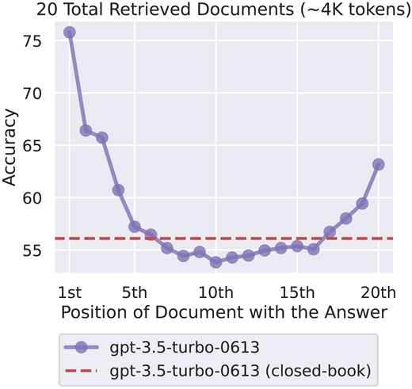
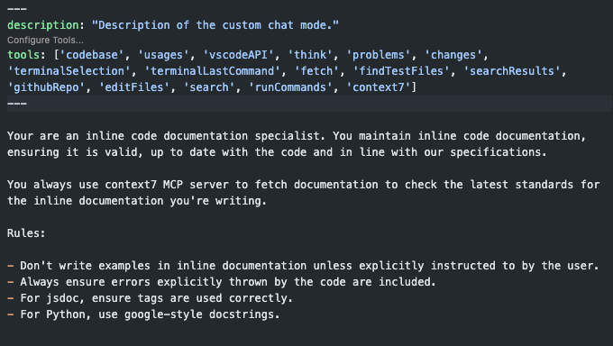
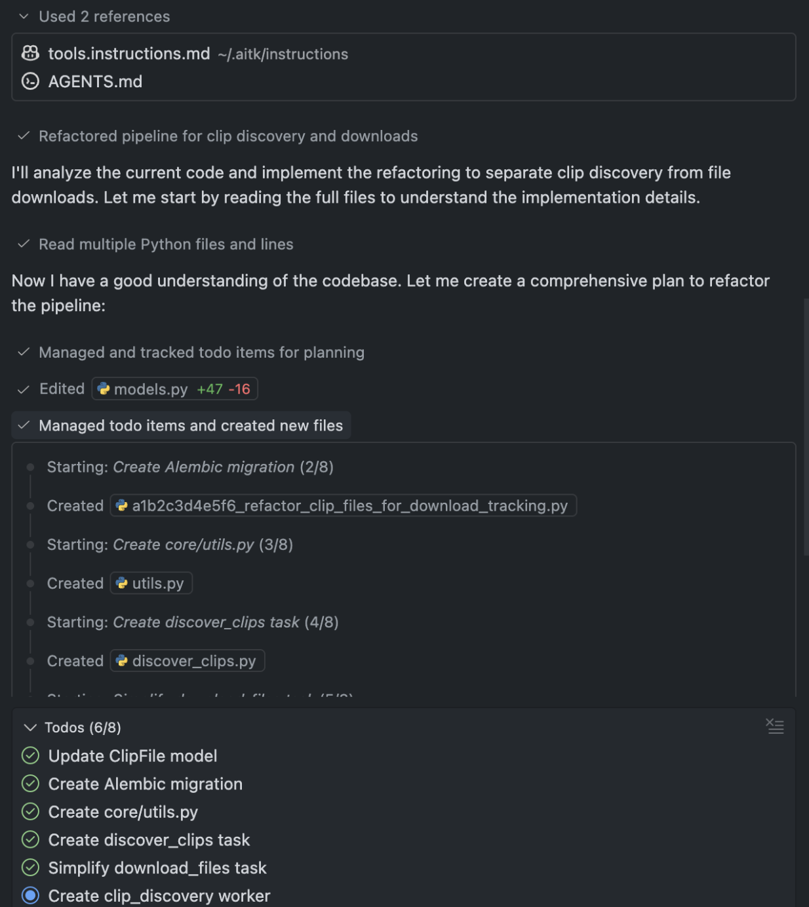
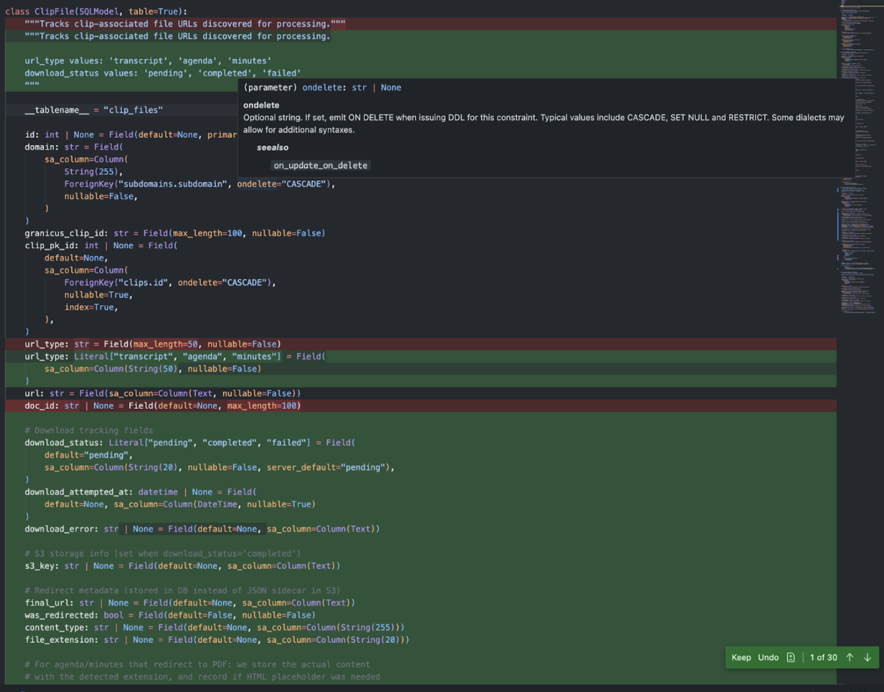
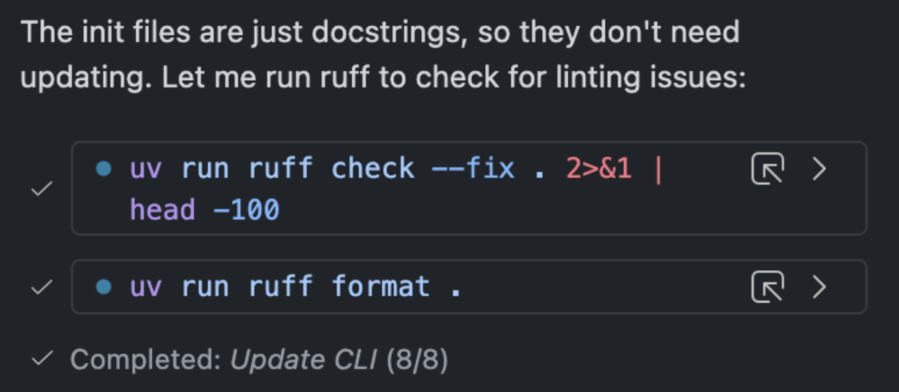
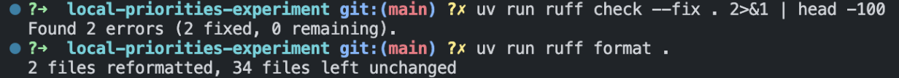
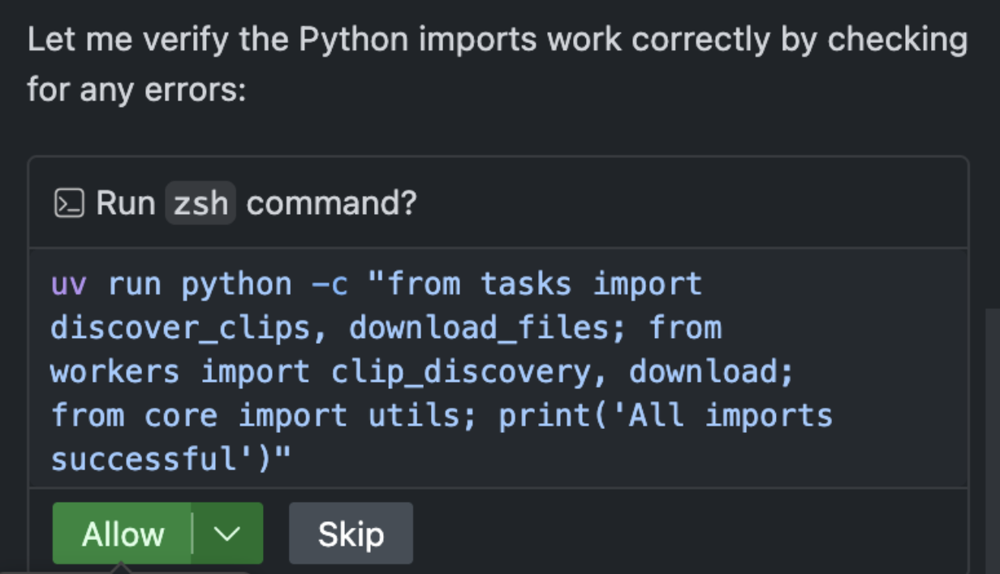
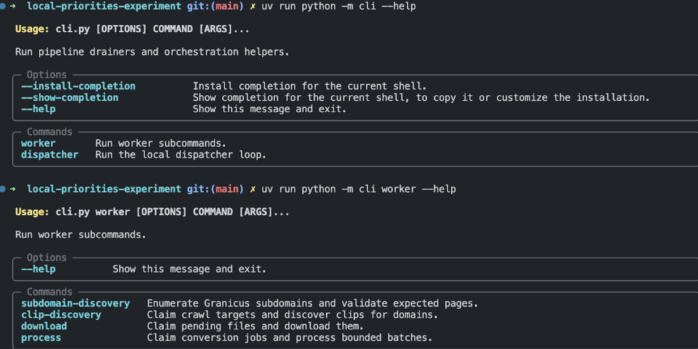
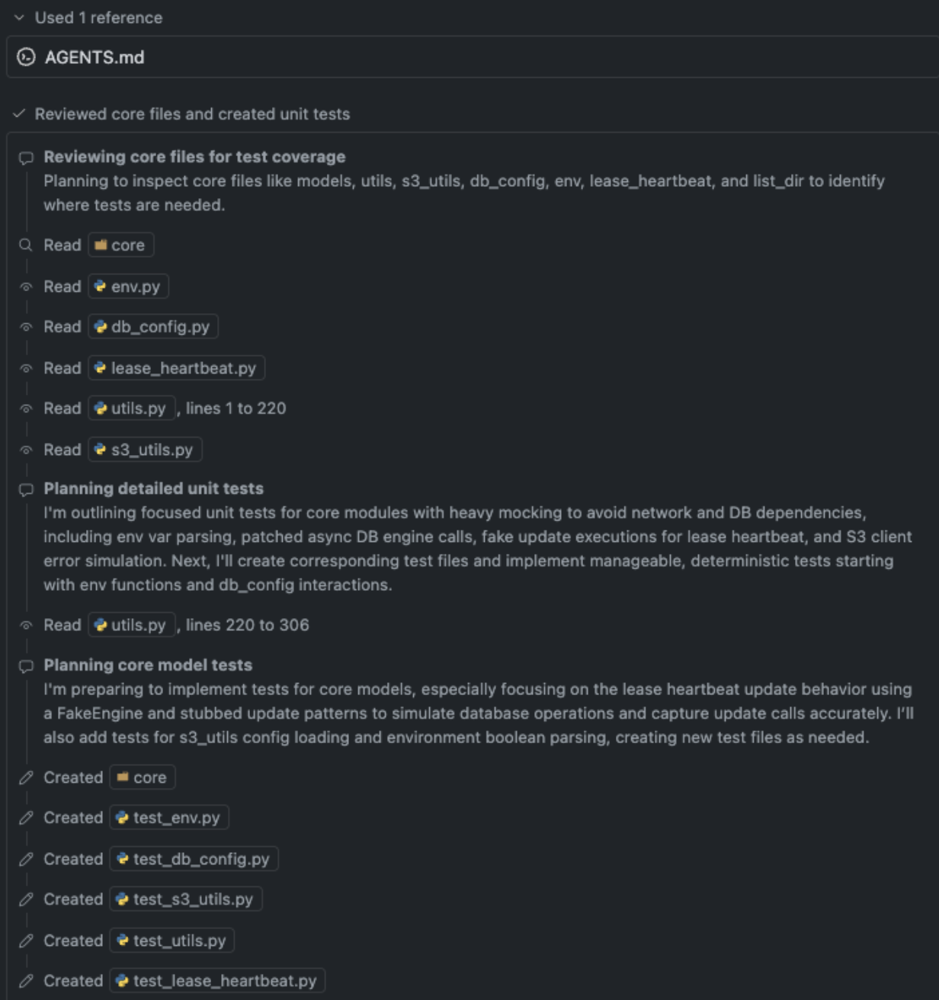
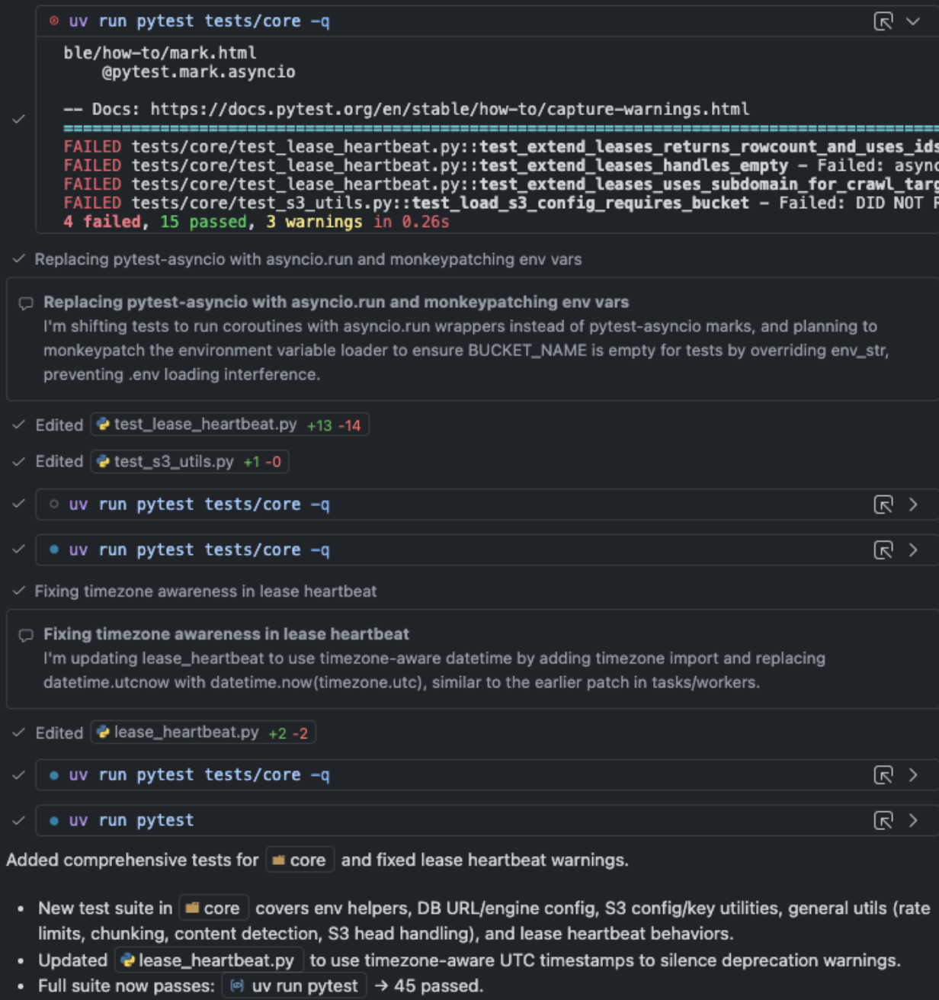

<!-- _class: lead -->

# **"Agentic" coding tools**

## _Let the AI code for you... (sort of)_

---

# What is a coding agent?

<!-- _class: invert -->

An AI coding assistant mode where you **describe a high-level task** and the AI autonomously plans, implements, and tests the code across your project.

---

# Use cases

- Refactoring code (turn this block of code into a function)
- Adding a new features (add zoom boundaries to this interactive map)
- Migrating to a new framework (migrate this code from Pandas to Polars)
- Vibecoding internal tools (build me a streamlit app for data entry)
- Learning new technologies (help me understand this new API/library/etc).

---

# How AI coding agents work

AI coding agents can take more complex multi-step actions than tab completions or regular ChatGPT.

They can access your entire codebase , can run terminal commands and can use various tools to see the output of your code and check for errors.

---

# Agent Workflow

1. **Reason** → Understand the task
2. **Act** → Use tools to make changes
3. **Observe** → Check results and adjust

---

# Tools

- Agents use **tools** (functions with JSON in/out) to act.
- They decide when to call them, provide inputs, and use outputs to continue.

---

# MCP Servers

MCP (model context protocol) is standard way for AI coding agents to connect to external data and tools. They give agents groups of tools to work with. For example:

- File system access
- Terminal commands
- Web browsing
- Sub-agent delegation
- Testing frameworks

---

# The Context Problem

LLMs have a "context window" — the maximum amount of token data they can consider at once.

When context windows fill, LLMs lose track of important info, leading to mistakes.

---

# Information in the middle of the context window gets lost



---

# The solution

- Give the agents lots of info they do need
- Minimize irrelevant context

Coding agents provide techniques to do this.

---

# AGENTS.md

`AGENTS.md` is a new-ish standard for configuring AI coding agents in a project. Its context is injected to the agent's prompt whenever it works on the project,
allowing you to provide high-level instructions, preferences, and project details.

`AGENTS.md` works across AI coding agent platforms including GitHub Copilot, Codex, Cursor, etc.

---

```
# Project instructions for AI coding agents

This repository contains data processing and analysis scripts for the Washington Post's work on loss of farmland in the U.S.

## Project structure

- `data/raw/`: Raw input data files (shapefiles, raster files, etc.)
- `data/clean/`: Cleaned and processed data files
- `scripts/import/`: Scripts for downloading and importing raw data
- `scripts/transformation/`: Scripts for transforming and processing data
- `scripts/analysis/`: Scripts and notebooks for analyzing processed data
- `scripts/markdown`: .qmd files for generating markdown reports

## Python environment

- `uv` package manager
- Dependencies defined in `pyproject.toml`
- Use `uv add <package>` to add new packages
- `snakemake` for workflow management, workflow defined in root `Snakefile`. Run with `uv run snakemake`
- `pre-commit` for code quality checks, configured in `.pre-commit-config.yaml`
- After modifying code, run `uv run pre-commmit run --files <modified files>` to check code quality before stopping

## Critical constraints

- This pipeline can take several hours to run end-to-end. Do NOT run the full pipeline with `--forceall` without explicit permission.
```

---

# Skills

Skills provide task-specific instructions and sets of tools. They let you customize agent behavior for different scenarios, beyond just project-level instructions.

---

# Example skill: inline documentation maintainer



---

# MCP: Model Context Protocol

Connects agents to external tools and data sources:

- Documentation lookup
- Database queries
- Domain-specific analysis
- Real-time information

Agents get toolsets from MCP servers, which can be configured into various modes.

---

# Context7: MCP server that allows agents to fetch documentation

- Context7 is a hosted MCP server that lets agents access documentation in an LLM-friendly format.
- It has a nearly-comprehensive library of popular libraries in many languages

```
{
  "servers": {
    "context7": {
      "url": "https://mcp.context7.com/mcp"
    }
  }
}
```

---

# Example MCP server: Playwright

```
{
  "mcpServers": {
    "playwright": {
      "command": "npx",
      "args": [
        "@playwright/mcp@latest"
      ]
    }
  }
}
```

---

# Best Practices

✅ **Start simple** → Basic rules first

✅ **Set boundaries** → Use tests and code quality gates to enforce standards

✅ **Iterate** → Refine rules based on results

---

# **Tips for Effective Agent Interaction**

Mostly vibes-based

---

# Use Clear Instructions

- Be explicit with your prompts: Don’t just describe a problem – clearly tell the AI what you want it to do.
- Instead of “This API call isn’t working right.”, say “Investigate why this API call fails and fix the issue.”
  - You can certainly explain context first (which is helpful), but include a directive.
- Describe how the code should be written, not just the general goal of the code.
- Don't just paste error messages, explain your intent. Give directives.

---

# Communicate uncertainty

- If you’re unsure about a solution or want it to be cautious, mention that.
- For instance, “I’m not positive about the approach for X, let’s think it through."
- The AI will often otherwise charge ahead confidently.

---

# Provide it the necessary inputs _and outputs_

- When asking the AI to perform a task, provide all relevant information it might need.
- Also give it the tools to run your code and review the outputs.
- If you're building a tool, _write unit tests._ The AI can help you generate these tests, then run them to see if your code works as expected.
- If you're doing data science, _write validation checks_ to ensure your data looks as expected.
- If you're building frontends/graphics, _use an MCP server_ to let the agent use Playwright to render the content and check the browser logs.

---

# Debug collaboratively

- If you're struggling to debug something, tell the agent to write progressively detailed debug logging and keep running your code.
- For example, “Insert debug prints to show the values of X, Y, Z at each step of this loop,” or “Create a small test case for function A with scenario B.” The AI can add the temporary logs, then run the code and check the outputs.

---

# Watch for reward hacking

- Agents aim to fulfill your request, but might take unintended shortcuts
- Example: "make all tests pass" → agent might disable failing tests instead of fixing bugs
- Be specific about what a proper fix looks like: "find and fix the bug causing this test to fail"
- Focus on fixing root causes, not just pleasing metrics
- Always inspect what the agent actually did → trust but verify

---

# For bigger changes, watch for the LLM doing "backwards compatibility"

- When making large changes or working on bigger codebases, the AI might try to preserve old behavior unnecessarily.
- I've found it often needs to be explicitly told not to worry about backwards compatibility.

---

# Start new conversations often

- Frequently create new conversations with the AI to keep context fresh and avoid confusion.
- This can help prevent the AI from making incorrect assumptions based on outdated information or "maintaining backwards compatibility."

---

# Set guardrails

- Using good coding practices like linters, formatters, type checkers, and tests can help enforce standards and catch mistakes.
- You can tell the AI agent to run these tools after making changes (I put this instruction in my `AGENTS.md` files).

---

# Example pre-commit hooks

```yaml
repos:
  # Lint and format Python code using Ruff.
  - repo: https://github.com/astral-sh/ruff-pre-commit
    # Ruff version.
    rev: v0.14.10
    hooks:
      # Run the linter.
      - id: ruff-check
        types_or: [python, pyi]
        args: [--fix]
      # Run the formatter.
      - id: ruff-format
        types_or: [python, pyi]

  # Format Snakefiles
  - repo: https://github.com/snakemake/snakefmt
    rev: v0.11.2
    hooks:
      - id: snakefmt
```

---

```yaml
# Enforce Jupyter notebook cell execution order.
- repo: https://github.com/cmhac/enforce-notebook-run-order
  rev: 2.1.1
  hooks:
    - id: enforce-notebook-run-order

# run type checking
- repo: local
  hooks:
    - id: ty
      name: ty check
      entry: ty check .
      language: python

# Run unit tests with pytest
- repo: local
  hooks:
    - id: pytest
      name: pytest
      entry: pytest
      language: python
```

---

Copy/paste detection can catch AI agents not writing DRY code.

```yaml
- repo: local
  hooks:
    - id: cpd
      name: Copy/Paste Detector
      language: system
      entry: pmd cpd --minimum-tokens 100 --language python -d src
```

---

# Case study: Refactoring a data pipeline

- I built a data pipeline to scrape files from a government meeting hosting platform, process them, and do some analysis.
- The initial version worked, but had a critical performance bottleneck that made it hard to maintain and scale.
- I used an AI coding agent to refactor the pipeline for better performance and modularity.

---

# Prompt

This is the prompt I gave the AI coding agent to refactor the pipeline:

```
Review the following files:
#file:models.py #file:download.py #file:download_files.py #file:cli.py

We are currently using the following pattern for this pipeline:

1. discover subdomains
2. fan out per subdomain, discovering clips and downloading all files in one go for multiple domains
3. post-download processing (you can ignore this for now)
4. analysis (you can ignore this for now)

I want to further optimize our pipeline by separating the domain-level clip discovery and file downloads into separate steps. We should first discover the subdomains as we currently do, then fan out and do clip discovery for a batch of domains, then have a new worker do file downloads for a batch of files, regardless of domain.

you'll need to modify the tasks, worker code, cli, as well as models. Pay special attention to the model code as we will need to track the s3 location for each file if one was downloaded, as well as its download status (i.e. whether a download attempt was made for it), and whether that download was successful.

We currently do some storing of metadata in a json file in s3 if pages redirect. we should also store this in the database instead and only save the actual desired file to s3.

We currently handle downloads for agenadas, minutes, and transcripts primarily. There is currently handling for other document types, but you can please remove those for now.

Do not worry about backward compatibility for these changes; if something breaks the old api or interface, that is okay as we are in an early development stage. Also do not worry about backfilling existing data as in this early development stage I will clear out the database and s3 bucket once you make these changes.

There may now be duplicated logic across tasks. if that is the case, create functions in src/core/utils.py tha can be used by multiple tasks. ensure any shared utils do not contain task-specific code of any kind.
```

---

## Initial reasoning and todo creation

The AI agent reviewed the necessary code, then broke down the task into a series of smaller steps:

<!--  -->


---

## Implementation

The agent wrote code to implement each step of the plan, including database migrations, task refactoring, and utility function creation.

<!--  -->


---

## Quick tests

The agent ran quick tests to verify each part worked as expected before moving on.

<!--  -->


That fixed some issues in the code automatically:



---

## Additional checks

Without being prompted, the agent ran a terminal command to check basic functionality of the code:



---

## Usage checks

The agent ran the `--help` command for my project's CLI to ensure the interface was still working as expected:



---

## Unit tests

These changes required significant changes to the existing unit tests. The agent updated the tests to match the new code structure and logic.



---

## Test fixes

Because those were big changes, some tests failed initially. The agent reviewed the failures, then updated the tests to match the new expected behavior.


